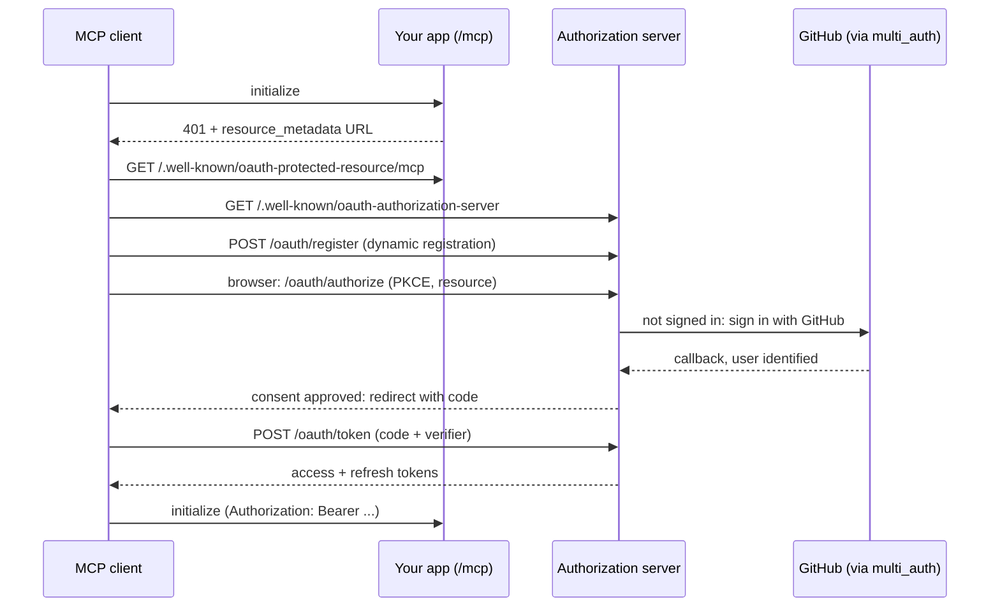

# Authentication

By default your MCP endpoint is open, and each tool call is authenticated by your routes'
own filters, using the headers the client sends. That's enough for many apps. This page
covers the options, from API keys up to a complete OAuth sign-in for MCP clients, built
with [multi_auth](https://github.com/msa7/multi_auth) and
[authly](https://github.com/azutoolkit/authly).

## Choosing an approach

| Approach | Use it when | Configuration |
|---|---|---|
| **Route auth only** | the API is public, or every client can send a fixed header | nothing |
| **API keys** | agents and scripts with long lived credentials | `auth_probe`, and the client sends a header |
| **OAuth sign-in** | people connect from Claude, VS Code, Cursor, ... and sign in with their own account | `auth_probe` + `resource_metadata`, and an OAuth authorization server |

Whichever you choose, tool calls run your real routes with the client's `Authorization`,
`Cookie` and `X-API-Key` headers. Permissions are enforced exactly as they are for HTTP
requests. Your MCP server can't do anything the user couldn't do with the API directly.

## Why MCP needs more than route auth

MCP clients only sign in, or refresh an expired token, when the **MCP endpoint itself**
responds with HTTP `401` and a `WWW-Authenticate` challenge. With route auth alone,
connecting always succeeds, and a `401` from a route reaches the model as a failed tool
call it can't fix. Enabling authentication moves the check to the endpoint:

- **Every request is checked:** `initialize`, tool calls, and the notification stream.
  Failures get a real `401`.
- **Token expiry is caught:** if a route rejects a tool call with `401` (an expired
  token, say), the endpoint answers `401` so the client refreshes and retries.
- **Checks are cached:** successful checks are cached for each credential for
  `auth_cache_ttl` (1 minute), so your auth route isn't called on every message.

## API keys

Point `auth_probe` at any route that requires authentication. It's called in-process with
the client's headers, and a 2xx response means the request is authenticated:

```crystal
ActionController::MCPServer.auth_probe = "/api/users/current"
```

Clients send their key on every request:

```shell
claude mcp add --transport http my-app https://my-app.example.com/mcp \
  --header "X-API-Key: <key>"
```

Need logic that isn't a route? Use `authenticator` instead:

```crystal
ActionController::MCPServer.authenticator = ->(request : HTTP::Request) do
  ApiKey.valid?(request.headers["X-API-Key"]?)
end
```

## OAuth sign-in

For people, OAuth is seamless: they add your server's URL to their client, a browser
opens, they sign in and approve the client, and they're connected. Tokens refresh
automatically.

### How it works

MCP builds on standard OAuth: protected resource metadata
([RFC 9728](https://www.rfc-editor.org/rfc/rfc9728)), authorization server metadata
([RFC 8414](https://www.rfc-editor.org/rfc/rfc8414)), dynamic client registration
([RFC 7591](https://www.rfc-editor.org/rfc/rfc7591)) and the authorization code flow with
[PKCE](https://www.rfc-editor.org/rfc/rfc7636):



Spider-Gazelle provides the first half: the challenge and the protected resource metadata
are served by `MCPServer` once you configure `resource_metadata`:

```crystal
ActionController::MCPServer.tap do |mcp|
  mcp.auth_probe = "/api/users/current"
  mcp.resource_metadata = ->(request : HTTP::Request) do
    ActionController::MCPServer::ResourceMetadata.new(
      authorization_servers: ["https://#{request.hostname}"],
      scopes_supported: ["api"],
    )
  end
end
```

The authorization server is either an existing identity platform that supports dynamic
client registration, or part of your app. The rest of this page builds one into your app:
**multi_auth** answers "who is this person?" (GitHub, Google, and other providers) and
**authly** answers "give this MCP client a token".

## Worked example: multi_auth + authly

A small notes API that MCP clients sign in to with GitHub. It's one app that is both the
**resource server** (the API and `/mcp`) and the **authorization server**.

!!! success "Tested"
    This example was built and tested end to end with action-controller 8.3.2, authly
    `master` (`3e96031`) and multi_auth `master` (`f1f60bf`). The test covered
    registration, sign-in, consent, PKCE token exchange, MCP calls with the token,
    refresh, and rejection of replayed codes, forged `state` and wrong verifiers.

| File | Role |
|---|---|
| `src/config.cr` | configures the session, authly, multi_auth and the MCP server |
| `src/controllers/api.cr` | the protected API, verifying access tokens in a `before_action` |
| `src/controllers/sessions.cr` | signs users in with multi_auth, checking `state` |
| `src/controllers/authorization.cr` | metadata, registration, authorize (with consent) and token endpoints |
| `src/oauth/*.cr` | client registry, token minting and the authly fixes |

### 1. Dependencies

???+ example "shard.yml"

    ```yaml
    name: mcp-auth-example
    version: 0.1.0

    targets:
      app:
        main: src/app.cr

    dependencies:
      action-controller:
        github: spider-gazelle/action-controller
        version: ~> 8.3

      # OAuth 2 authorization server library
      authly:
        github: azutoolkit/authly
        branch: master

      # sign in with GitHub, Google, etc. master adds `state` to `authorize_uri`
      multi_auth:
        github: msa7/multi_auth
        branch: master
    ```

!!! warning "Use `master` for both shards"
    multi_auth's tagged release can't pass a `state` to the provider, which you need for
    CSRF protection. The authly fixes below target `master`.

### 2. Configuration

The app is its own issuer, and the MCP server advertises it in the protected resource
metadata:

???+ example "src/config.cr"

    ```crystal
    require "action-controller"
    require "action-controller/mcp"
    require "authly"
    require "multi_auth"
    require "multi_auth/providers/github"

    module App
      # the public URL of this app, it's both the MCP resource and the OAuth issuer
      URL = ENV["APP_URL"]? || "http://localhost:3000"

      # the scope MCP clients request
      SCOPE = "api"

      # DEVELOPMENT ONLY: adds a "dev" sign in that skips the identity provider
      DEV_LOGIN = ENV["DEV_LOGIN"]? == "1"

      # is this a resource indicator (RFC 8707) for this app?
      def self.resource?(resource : String) : Bool
        resource == URL || resource.starts_with?("#{URL}/")
      end
    end

    require "./models/*"
    require "./oauth/*"
    require "./controllers/application"
    require "./controllers/*"

    # the server is required after the controllers
    require "action-controller/server"

    ActionController::Server.before(
      ActionController::ErrorHandler.new(ENV["SG_ENV"]? == "production", ["X-Request-ID"]),
      ActionController::LogHandler.new(["code", "code_verifier", "refresh_token", "state"], ms: true)
    )

    ActionController::Session.configure do |settings|
      settings.key = "_mcp_example_session"
      settings.secret = ENV["SESSION_SECRET"]? || Random::Secure.hex(64)
      settings.secure = App::URL.starts_with?("https://")
    end

    # the OAuth authorization server
    Authly.configure do |config|
      # HS256 signs and verifies with the same key
      jwt_secret = ENV["JWT_SECRET"]? || Random::Secure.hex(32)
      config.secret_key = jwt_secret
      config.public_key = jwt_secret
      config.issuer = App::URL
      config.code_ttl = 5.minutes
      config.access_ttl = 1.hour
      config.refresh_ttl = 30.days
      config.clients = AuthServer::CLIENTS
    end

    # users sign in with GitHub
    MultiAuth.config("github", ENV["GITHUB_CLIENT_ID"]? || "", ENV["GITHUB_CLIENT_SECRET"]? || "")

    # the MCP server challenges clients that don't present a valid access token
    ActionController::MCPServer.tap do |mcp|
      mcp.server_name = "notes"
      mcp.auth_probe = "/api/users/current"
      mcp.resource_metadata = ->(_request : HTTP::Request) do
        ActionController::MCPServer::ResourceMetadata.new(
          authorization_servers: [App::URL],
          scopes_supported: [App::SCOPE],
        )
      end
    end
    ```

??? example "src/app.cr"

    ```crystal
    require "./config"

    port = ENV["PORT"]?.try(&.to_i) || 3000
    server = ActionController::Server.new(port, "127.0.0.1")
    ActionController::MCPServer.mount(server, "/mcp")

    Signal::INT.trap { server.close }
    server.run { puts "Listening on #{server.print_addresses}" }
    ```

### 3. Signing in with multi_auth

multi_auth handles the provider round trip. It doesn't validate the OAuth `state`
parameter, so store a random value in the session and check it in the callback. That
stops an attacker from logging a victim in to the attacker's account.

???+ example "src/controllers/sessions.cr"

    ```crystal
    # signs users in with an identity provider, using multi_auth
    @[AC::MCP(hide: true)]
    class Sessions < Application
      base "/auth"

      PROVIDERS = ["github"]

      # the sign in page
      @[AC::Route::GET("/")]
      def index
        providers = App::DEV_LOGIN ? PROVIDERS + ["dev"] : PROVIDERS
        links = providers.map { |name| %(<li><a href="/auth/#{name}">Sign in with #{name}</a></li>) }
        render html: page("Sign in", "<ul>#{links.join}</ul>")
      end

      # redirects to the identity provider
      @[AC::Route::GET("/:provider")]
      def sign_in(provider : String)
        # DEVELOPMENT ONLY: sign in without an identity provider
        if provider == "dev" && App::DEV_LOGIN
          return signed_in User.save(User.new("dev:developer", "Developer"))
        end

        # multi_auth doesn't validate `state`, we check it in the callback
        state = Random::Secure.urlsafe_base64(32)
        session["oauth_state"] = state
        redirect_to engine(provider).authorize_uri(state: state), :see_other
      end

      # the identity provider redirects back here
      @[AC::Route::GET("/:provider/callback")]
      def callback(provider : String, state : String = "")
        expected = session.delete("oauth_state").to_s
        if expected.empty? || !Crypto::Subtle.constant_time_compare(expected, state)
          render :bad_request, text: "invalid sign in state, please try again"
        end

        engine = engine(provider)
        auth = begin
          engine.user(request.query_params)
        rescue error
          Log.warn(exception: error) { "#{provider} sign in failed" }
          render :unauthorized, text: "sign in failed"
        end
        signed_in User.from(auth)
      end

      private def engine(provider : String) : MultiAuth::Engine
        raise AuthServer::Error.new("invalid_request", "unknown provider", :not_found) unless provider.in?(PROVIDERS)
        MultiAuth.make(provider, "#{App::URL}/auth/#{provider}/callback")
      end

      # continues the OAuth authorization request that required sign in
      private def signed_in(user : User)
        session["user_id"] = user.id
        redirect_to session.delete("return_to").try(&.to_s) || "/auth", :see_other
      end
    end
    ```

??? example "src/models/user.cr"

    ```crystal
    # a signed in person. Stored in memory for the example, use your database
    struct User
      include JSON::Serializable

      getter id : String
      getter name : String
      getter email : String?

      def initialize(@id, @name, @email = nil)
      end

      STORE = {} of String => User

      def self.find?(id : String) : User?
        STORE[id]?
      end

      def self.save(user : User) : User
        STORE[user.id] = user
      end

      # finds or creates the user for an identity provider account
      def self.from(auth : MultiAuth::User) : User
        save new("#{auth.provider}:#{auth.uid}", auth.name || auth.nickname || auth.uid, auth.email)
      end
    end
    ```

!!! note "GitHub OAuth app"
    Create an OAuth app in GitHub (**Settings → Developer settings → OAuth Apps**) and set
    its callback URL to `<APP_URL>/auth/github/callback`. multi_auth's GitHub provider
    relies on the registered callback. Then set `GITHUB_CLIENT_ID` and
    `GITHUB_CLIENT_SECRET`.

### 4. The authorization server

These endpoints are what MCP clients talk to:

- **Metadata:** `/.well-known/oauth-authorization-server`, where clients discover the
  endpoints.
- **Registration:** `/oauth/register`. Every client is public (no secret), so PKCE
  proves possession.
- **Authorize:** `/oauth/authorize`. It sends the user to sign in if needed, shows a
  consent page protected by a CSRF token, then issues a code. S256 PKCE is required.
- **Token:** `/oauth/token`. Codes and refresh tokens are single use, and refresh
  tokens rotate.

???+ example "src/controllers/authorization.cr"

    ```crystal
    # the OAuth 2 authorization server that MCP clients sign in with
    @[AC::MCP(hide: true)]
    class Authorization < Application
      base "/"

      alias Tokens = AuthServer::Tokens
      alias Error = AuthServer::Error
      CLIENTS = AuthServer::CLIENTS

      # authorization server metadata (RFC 8414), where MCP clients discover the endpoints
      @[AC::Route::GET("/.well-known/oauth-authorization-server")]
      def metadata
        {
          issuer:                                App::URL,
          authorization_endpoint:                "#{App::URL}/oauth/authorize",
          token_endpoint:                        "#{App::URL}/oauth/token",
          registration_endpoint:                 "#{App::URL}/oauth/register",
          scopes_supported:                      [App::SCOPE],
          response_types_supported:              ["code"],
          grant_types_supported:                 ["authorization_code", "refresh_token"],
          token_endpoint_auth_methods_supported: ["none"],
          code_challenge_methods_supported:      ["S256"],
        }
      end

      # dynamic client registration (RFC 7591)
      @[AC::Route::POST("/oauth/register", body: :client_metadata, status_code: HTTP::Status::CREATED)]
      def register(client_metadata : Hash(String, JSON::Any)) : Authly::DynamicClient
        CLIENTS.register(client_metadata)
      end

      # the user signs in and approves the client, which receives an authorization code
      @[AC::Route::GET("/oauth/authorize")]
      @[AC::Route::POST("/oauth/authorize")]
      def authorize(
        response_type : String,
        client_id : String,
        redirect_uri : String,
        code_challenge : String = "",
        code_challenge_method : String = "",
        scope : String = "",
        state : String = "",
        resource : String = "",
        decision : String = "",
        csrf_token : String = "",
      )
        # errors are never redirected to an unverified redirect_uri
        client = CLIENTS.find(client_id)
        raise Error.new("invalid_request", "unknown client or redirect_uri") unless client && client.redirect_uris.includes?(redirect_uri)
        raise Error.new("unsupported_response_type") unless response_type == "code"
        raise Error.new("invalid_request", "PKCE with S256 is required") if code_challenge.empty? || code_challenge_method != "S256"
        raise Error.new("invalid_target") unless resource.empty? || App.resource?(resource)
        scope = scope.presence || App::SCOPE
        raise Error.new("invalid_scope") unless CLIENTS.allowed_scopes?(client_id, scope)

        # sign in first, then return here
        unless user = session_user
          session["return_to"] = request.resource
          redirect_to "/auth", :see_other
        end

        # ask the user to approve the client
        csrf = (session["csrf_token"] ||= Random::Secure.urlsafe_base64(32)).to_s
        unless request.method == "POST" && decision.in?("allow", "deny") && Crypto::Subtle.constant_time_compare(csrf, csrf_token)
          fields = {client_id: client_id, redirect_uri: redirect_uri, response_type: response_type, code_challenge: code_challenge,
                    code_challenge_method: code_challenge_method, scope: scope, state: state, resource: resource, csrf_token: csrf}
          response.headers["Content-Security-Policy"] = "frame-ancestors 'none'"
          render html: consent_page(client, user, fields)
        end

        redirect_to with_params(redirect_uri, error: "access_denied", state: state) if decision == "deny"

        code = Authly.code("code", client_id, redirect_uri, scope, code_challenge, code_challenge_method, user.id).as(Authly::Code)
        redirect_to with_params(redirect_uri, code: code.to_s, state: state)
      end

      # exchanges an authorization code or refresh token for tokens
      @[AC::Route::POST("/oauth/token")]
      def token(
        grant_type : String,
        client_id : String,
        code : String = "",
        redirect_uri : String = "",
        code_verifier : String = "",
        refresh_token : String = "",
        resource : String = "",
      ) : Tokens::Response
        response.headers["Cache-Control"] = "no-store"
        raise Error.new("invalid_target") unless resource.empty? || App.resource?(resource)

        case grant_type
        when "authorization_code"
          # authly validates the code, client, redirect_uri and PKCE verifier
          Authly::AuthorizationCode.new(client_id, "", redirect_uri, code, code_verifier).authorized?
          claims = Authly.jwt_decode(code).first
          raise Error.new("invalid_grant") unless claims["client_id"]? == client_id
          Tokens.spend!(claims["jti"].as_s)
          Tokens.issue(claims["user_id"].as_s, client_id, claims["scope"].as_s)
        when "refresh_token"
          # authly validates the token signature, expiry and the client
          Authly::RefreshToken.new(client_id, "", refresh_token).authorized?
          claims = Authly.jwt_decode(refresh_token).first
          raise Error.new("invalid_grant") unless claims["typ"]? == "refresh" && claims["cid"]? == client_id
          Tokens.spend!(claims["jti"].as_s) # refresh tokens rotate
          Tokens.issue(claims["sub"].as_s, client_id, claims["scope"].as_s)
        else
          raise Error.new("unsupported_grant_type")
        end
      rescue error : Authly::Error
        raise Error.new(error.type.to_s, error.message, HTTP::Status.new(error.code))
      end

      private def consent_page(client : Authly::DynamicClient, user : User, fields) : String
        hidden = fields.map { |key, value| %(<input type="hidden" name="#{key}" value="#{HTML.escape(value)}">) }.join
        page("Allow access?", <<-HTML)
          <p>Signed in as <b>#{HTML.escape(user.name)}</b>.</p>
          <p><b>#{HTML.escape(client.client_name || client.client_id)}</b> wants to use your account
             (scope: #{HTML.escape(fields[:scope])}) and will return to #{HTML.escape(fields[:redirect_uri])}</p>
          <form method="post" action="/oauth/authorize">#{hidden}
            <button name="decision" value="allow">Allow</button>
            <button name="decision" value="deny">Deny</button>
          </form>
          HTML
      end

      private def with_params(uri : String, **params) : String
        uri = URI.parse(uri)
        query = uri.query_params
        params.each { |key, value| query[key.to_s] = value unless value.empty? }
        uri.query_params = query
        uri.to_s
      end
    end
    ```

??? example "src/oauth/clients.cr"

    ```crystal
    module AuthServer
      # OAuth clients, registered by MCP clients using dynamic client registration (RFC 7591).
      # Authly calls these methods when validating authorization and token requests.
      class Clients
        include Authly::AuthorizableClient

        # authly's device flow handler, which we don't use, needs `any?` to compile
        include Enumerable(Authly::Client)

        def each(& : Authly::Client ->) : Nil
        end

        GRANT_TYPES = {"authorization_code", "refresh_token"}

        # every client is public: they can't keep a secret, so PKCE proves the
        # code is being redeemed by the client that requested it
        def register(metadata : Hash(String, JSON::Any)) : Authly::DynamicClient
          metadata["token_endpoint_auth_method"] = JSON::Any.new("none")
          client = begin
            Authly::DynamicClient.from_registration_request(metadata)
          rescue error
            raise Error.new("invalid_client_metadata", error.message)
          end
          raise Error.new("invalid_client_metadata") unless client.valid? && supported?(client)

          Authly.config.client_store.store(client)
          client
        end

        def find(client_id : String) : Authly::DynamicClient?
          Authly.config.client_store.fetch(client_id)
        end

        def valid_redirect?(client_id : String, redirect_uri : String) : Bool
          !!find(client_id).try(&.redirect_uris.includes?(redirect_uri))
        end

        # public clients have no secret
        def authorized?(client_id : String, client_secret : String)
          !find(client_id).nil?
        end

        def allowed_scopes?(client_id : String, scopes : String) : Bool
          scopes.split.all?(App::SCOPE)
        end

        def allowed_grant_type?(client_id : String, grant_type : String) : Bool
          !!find(client_id).try(&.grant_types.includes?(grant_type))
        end

        private def supported?(client) : Bool
          client.grant_types.all?(&.in?(GRANT_TYPES)) &&
            client.response_types == ["code"] &&
            client.redirect_uris.all? { |uri| safe_redirect?(URI.parse(uri)) }
        end

        # https, or http on the loopback interface for native apps (RFC 8252)
        private def safe_redirect?(uri : URI) : Bool
          return false if uri.fragment
          uri.scheme == "https" || (uri.scheme == "http" && uri.host.in?("localhost", "127.0.0.1", "[::1]"))
        end
      end

      CLIENTS = Clients.new
    end
    ```

??? example "src/oauth/tokens.cr"

    ```crystal
    module AuthServer
      # access and refresh tokens are JWTs signed by authly.
      # We mint them here as authly's `AccessToken` doesn't record the user (`sub`)
      module Tokens
        extend self

        # the token endpoint response (RFC 6749 section 5.1)
        struct Response
          include JSON::Serializable

          getter access_token : String
          getter token_type : String = "Bearer"
          getter expires_in : Int64
          getter refresh_token : String
          getter scope : String

          def initialize(@access_token, @expires_in, @refresh_token, @scope)
          end
        end

        def issue(user_id : String, client_id : String, scope : String) : Response
          config = Authly.config
          Response.new(
            access_token: encode("access", user_id, client_id, scope, config.access_ttl),
            expires_in: config.access_ttl.total_seconds.to_i64,
            refresh_token: encode("refresh", user_id, client_id, scope, config.refresh_ttl),
            scope: scope,
          )
        end

        # returns the claims of a valid access token issued for this app
        def verify(token : String) : JSON::Any?
          claims = Authly.jwt_decode(token).first
          claims if claims["typ"]? == "access" && claims["aud"]? == App::URL
        rescue JWT::Error
          nil
        end

        # authorization codes and refresh tokens can only be used once
        def spend!(jti : String) : Nil
          store = Authly.config.token_store
          raise Error.new("invalid_grant", "already used") if store.revoked?(jti)
          store.revoke(jti)
        end

        private def encode(type : String, user_id, client_id, scope, ttl : Time::Span) : String
          now = Time.utc
          Authly.jwt_encode({
            "typ"   => type,
            "iss"   => Authly.config.issuer,
            "aud"   => App::URL,
            "sub"   => user_id,
            "cid"   => client_id,
            "scope" => scope,
            "jti"   => Random::Secure.hex(16),
            "iat"   => now.to_unix,
            "exp"   => (now + ttl).to_unix,
          })
        end
      end
    end
    ```

??? example "src/oauth/error.cr"

    ```crystal
    module AuthServer
      # an OAuth error response (RFC 6749 section 5.2)
      class Error < Exception
        getter error : String
        getter status : HTTP::Status

        def initialize(@error, description : String? = nil, @status = HTTP::Status::BAD_REQUEST)
          super(description || error)
        end
      end
    end
    ```

### 5. The protected API

A `before_action` verifies the access token, so every route is protected, and so is every
MCP tool call, because tool calls run the same filters. `auth_probe` points at
`/api/users/current`, so the MCP endpoint uses exactly the same check.

???+ example "src/controllers/api.cr"

    ```crystal
    # the protected API, every request requires an access token from our authorization server
    abstract class Api < Application
      getter! user : User

      @[AC::Route::Filter(:before_action)]
      def authenticate
        header = request.headers["Authorization"]? || ""
        claims = AuthServer::Tokens.verify(header.lchop("Bearer ")) if header.starts_with?("Bearer ")
        @user = claims.try { |token| User.find?(token["sub"].as_s) }
        render :unauthorized, json: {error: "invalid_token"} unless @user
      end
    end

    # the signed in user
    class Users < Api
      base "/api/users"

      # returns the user the access token was issued to
      @[AC::MCP(root: true)]
      @[AC::Route::GET("/current")]
      def current : User
        user
      end
    end

    # your notes
    class Notes < Api
      base "/api/notes"

      NOTES = Hash(String, Array(String)).new { |hash, key| hash[key] = [] of String }

      # lists your notes
      @[AC::Route::GET("/")]
      def index : Array(String)
        NOTES[user.id]
      end

      # saves a note
      @[AC::Route::POST("/", status_code: HTTP::Status::CREATED)]
      def create(
        @[AC::Param::Info(description: "the text of the note")]
        text : String,
      ) : Array(String)
        NOTES[user.id] << text
      end
    end
    ```

??? example "src/controllers/application.cr"

    ```crystal
    abstract class Application < ActionController::Base
      # the user signed in to this browser session
      def session_user : User?
        session["user_id"]?.try { |id| User.find?(id.to_s) }
      end

      @[AC::Route::Exception(AuthServer::Error)]
      def oauth_error(error)
        render status: error.status, json: {error: error.error, error_description: error.message}
      end

      protected def page(title : String, body : String) : String
        <<-HTML
          <!doctype html>
          <html><head><meta charset="utf-8"><title>#{title}</title></head>
          <body style="font-family: sans-serif; max-width: 32rem; margin: 4rem auto">
            <h1>#{title}</h1>
            #{body}
          </body></html>
          HTML
      end
    end
    ```

### 6. authly fixes

At the time of writing, authly `master` needs three fixes to be secure for this flow.
Include this file, and remove each fix once it's fixed upstream:

???+ example "src/oauth/authly_patches.cr"

    ```crystal
    require "base64"
    require "digest/sha256"

    # Fixes for authly (azutoolkit/authly master), remove them once fixed upstream.
    module Authly
      struct Code
        # upstream reads the issuer and TTL from constants captured when authly is
        # required, before `Authly.configure` runs, so codes failed `jwt_decode`.
        # We also bind the code to its client.
        def jwt
          Authly.jwt_encode({
            "jti"          => Random::Secure.hex(32),
            "code"         => code,
            "client_id"    => client_id,
            "challenge"    => challenge,
            "method"       => method,
            "scope"        => scope,
            "user_id"      => user_id,
            "redirect_uri" => redirect_uri,
            "iat"          => Time.utc.to_unix,
            "iss"          => Authly.config.issuer,
            "exp"          => Authly.config.code_ttl.from_now.to_unix,
          })
        end
      end

      struct CodeChallengeBuilder::S256
        # RFC 7636: BASE64URL(SHA256(verifier)) without padding.
        # Upstream compares against standard, padded base64
        def valid?(code_verifier)
          code == Base64.urlsafe_encode(Digest::SHA256.digest(code_verifier), padding: false)
        end
      end

      class AuthorizationCode
        # upstream skips the PKCE check when the client omits `code_verifier`.
        # We require S256 PKCE for every code
        private def verify_challenge!
          valid = method == "S256" && !verifier.empty? && code_challenge.valid?(verifier)
          raise Error.invalid_grant unless valid
        end
      end
    end
    ```

| Problem | Effect |
|---|---|
| issuer and code TTL captured before `Authly.configure` runs | every code fails to decode |
| S256 challenge compared as padded, standard base64 | no standards-compliant client can redeem a code |
| PKCE skipped when `code_verifier` is omitted | a stolen code can be redeemed without the verifier |

Other things to know:

- **Don't use `Authly::Handler`:** its authorize handler takes the user from the query
  string.
- **Mint your own tokens:** authly's own access tokens don't identify the user, so
  `AuthServer::Tokens` mints JWTs with `sub`, `aud` and a `typ` claim.
- **Use one HS256 key:** the HS256 `secret_key` and `public_key` must be the same value.
- **Rescue authly errors yourself:** `@[AC::Route::Exception(Authly::Error)]` can't be
  used with authly's generic error class, so the token action rescues and re-raises.
- **Annotate each controller:** controller-level `@[AC::MCP(hide: true)]` isn't
  inherited, so annotate each controller you want hidden.

### 7. Try it

```shell
shards install
DEV_LOGIN=1 crystal run src/app.cr
```

Then connect a client:

```shell
claude mcp add --transport http notes http://localhost:3000/mcp
```

A browser opens to sign in. `DEV_LOGIN=1` adds a "Sign in with dev" option that skips
GitHub during development. **Never set it in production.** After approving the client, the
model starts with `users_current` (a root tool), and can open the `notes` toolbox to list
and create notes as you.

## Production checklist

The example keeps everything in memory, to stay readable. Before production:

- **Persist** users, clients, spent codes and refresh tokens in a database or Redis
  (with TTLs), so restarts and multiple instances work. MCP sessions also need sticky
  routing when you run more than one instance.
- **Load secrets** (`JWT_SECRET`, `SESSION_SECRET`) from your secret store, and prefer
  RS256/ES256 keys with rotation and a JWKS endpoint if other services verify tokens.
- **Accept any loopback port** for `http://127.0.0.1` and `localhost` redirect URIs
  ([RFC 8252 §7.3](https://www.rfc-editor.org/rfc/rfc8252#section-7.3)). Native MCP
  clients choose their callback port at runtime.
- **Support [client ID metadata documents](https://modelcontextprotocol.io/specification/2025-11-25/basic/authorization)**
  (MCP's preferred registration method), and rate limit dynamic registration and clean
  up unused clients.
- **Remember consent** per user and client, with a page to review and revoke access.
- **Add revocation**, CORS on the metadata, registration and token endpoints (for
  browser-based clients such as the MCP Inspector), and rate limits on authorize and
  token.
- **Generate `mcp.yml`** at build time so the model sees your tool descriptions.
- **Serve over HTTPS**, and remove the `DEV_LOGIN` shortcut.

!!! tip "A production reference"
    [PlaceOS auth](https://github.com/PlaceOS) is a production authorization server built
    on the same pieces (authly + multi_auth). It adds client ID metadata documents, dynamic
    registration with rate limits, loopback port matching, consent, PKCE enforcement and
    RFC 8707 resource checks. [PlaceOS REST API](https://github.com/PlaceOS/rest-api) shows
    the resource server side, with `auth_probe` and `resource_metadata`.

## See also

- [Configuration reference](configuration.md)
- [Filters](../guides/filters.md)
- [MCP authorization specification](https://modelcontextprotocol.io/specification/2025-11-25/basic/authorization)
